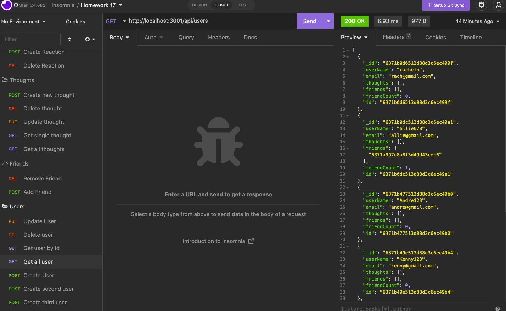

# urban-pancake

## Description 

This application is an API for a fictitious social network application. It uses Express.js, MongoDB and Mongoose ODM and was tested using Insomnia. In this project, I learned how to make a model and a schema using Moongoose ODM. I seperated the controllers and routes making my code more succinct. Doing this was new but I found my code to be alot cleaner once implimented. My motivation behind this project was to integrate NoSQL with modern functionality. Social media applications are extremely popular and making an API that matches the format of most social media applications provided expierence using NoSQL databases. The most difficult part of this project was matching the given models and schema. This provided insight on making models and schemas based off of a request given by a client. 

## Usage 

 The user can use various CRUD operations using the routes written in the api folder to create a new user with a username and an email. An email validator will verify that the submitted email is valid. Once a user is made, the user can add a friend to that user's friends array. The user can also update the information of the user. The user can also delete a friend which will modify the friends array associated with the user. 

 

 Since this is an API for a social media application, the user can create or delete a thought, update a thought, and even create or delete a reaction to a thought. To see this in action, follow the link below to the video of the routes being tested. 

 

https://drive.google.com/file/d/10fOsLcN1wwnkrV-pNLPcJFy5kIz4YIV3/view

## Installation 

In order to use this application, clone the repository onto your computer, install the respective dependencies, and run on localhost:3001 test using insonmia. 

## Credits 

I recieved help from tutor Meg Meyers. 

I used the email match regex from the class modules.

## License 

MIT License

Copyright (c) [2022] [AlejandraQuintero]

Permission is hereby granted, free of charge, to any person obtaining a copy
of this software and associated documentation files (the "Software"), to deal
in the Software without restriction, including without limitation the rights
to use, copy, modify, merge, publish, distribute, sublicense, and/or sell
copies of the Software, and to permit persons to whom the Software is
furnished to do so, subject to the following conditions:

The above copyright notice and this permission notice shall be included in all
copies or substantial portions of the Software.

THE SOFTWARE IS PROVIDED "AS IS", WITHOUT WARRANTY OF ANY KIND, EXPRESS OR
IMPLIED, INCLUDING BUT NOT LIMITED TO THE WARRANTIES OF MERCHANTABILITY,
FITNESS FOR A PARTICULAR PURPOSE AND NONINFRINGEMENT. IN NO EVENT SHALL THE
AUTHORS OR COPYRIGHT HOLDERS BE LIABLE FOR ANY CLAIM, DAMAGES OR OTHER
LIABILITY, WHETHER IN AN ACTION OF CONTRACT, TORT OR OTHERWISE, ARISING FROM,
OUT OF OR IN CONNECTION WITH THE SOFTWARE OR THE USE OR OTHER DEALINGS IN THE
SOFTWARE.